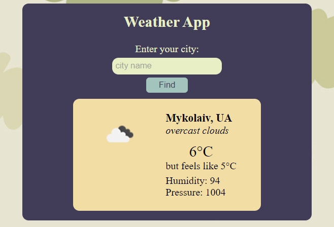

# weather-app [](https://www.python.org/)
Getting information from Weather API with Django

## Features

- you can get some information about weather in any existing city;
- you will get an error message when you try to enter dummy text.

## Steps to be followed for first time use
- run this command to clone this repository
```bash
git clone https://github.com/kttel/weather-app.git
```
- add new virtual environment in project directory and install all neccessary libraries from requirements.txt
```bash
cd weather

python -m venv venv

venv\Scripts\activate

pip install -r requirements.txt
```

## Usage

- in the directory with manage.py file run this command
```
python manage.py runserver
```

## Screenshots



## Contributing
Various pull requests are welcome. Project can be updated in any time.

Last update: 16.11.2022
